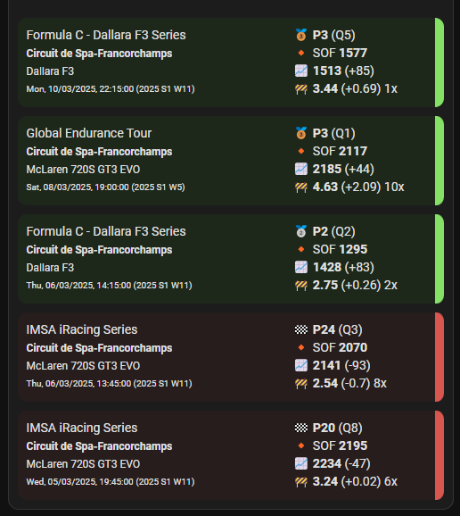

### next
- different layouts

### v1.2.0 - 2025-03-19
<a name="v1.2.0"></a>
added:
- Title uses drivers name if value string is "Default", otherwise accepts empty string to hide
- Events are colored depending on win, irating gain, irating loss and color can be customized
- Font sizes of series title (size L), date (size S) and car/track (size M) can be customized
- Event date/time has year, season and week added
- Date/time can be clicked to get to session results

fixed:
- removed static white background to integrate better with dark/light mode environments
- prefixed CSS classes to not interfere with global classes
- changed grid layout to better use card space

usage:

These are default values:

```yaml
type: custom:iracing-result-card
entity: sensor.DRIVER_NAME_driver
max: 5
title: Default
positive_color: #85e066
negative_color: #d7564f
win_color: #ffb730
second_color: ""
third_color: ""
font_size_s: 10px
font_size_m: 12px
font_size_l: 14px
```

Light Mode             |  Dark Mode |  Dark Mode with negative irating cards
:-------------------------:|:-------------------------:|:-------------------------:
  |   |  
