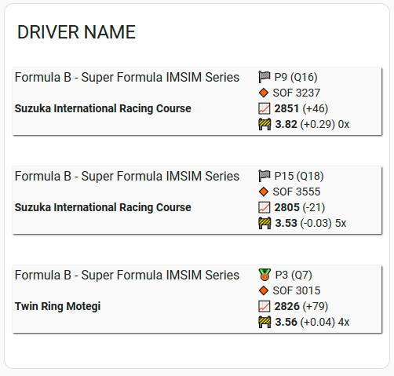
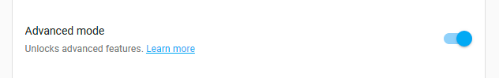
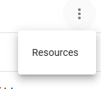
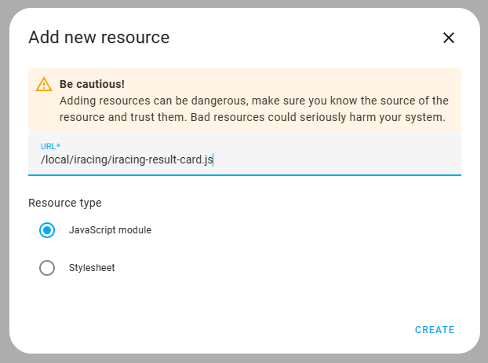

# Updated Iracing Result Card

This update changes the following:

Added:
- Title uses drivers name if used as "Default", otherwise accepts empty string to hide
- Events are colored depending on win, irating gain, irating loss
- Event date/time has year, season and week added
- Date/time can be clicked to get to session results

Fixed:
- removed static white background
- prefixed classes to not interfere with global classes
- changed grid layout to better use card space


# Iracing Result Card

This card displays the recent race results provided by the iRacing integration.



## iRacing integration

[Iracing integration](https://github.com/cazeaux/ha-iracing)

## Installation

Create a `www/iracing` folder in your `config`. If you have created the `www` folder for the first time, Home Assistant must be restarted.

Copy the `iracing-result-card.js` file into your `config/www/iracing` folder.

Add the custom resource by following these steps:

- Activate the advanced mode in your settings



- Go to the **dashboards** page in the parameters, and click on the three dots on the top right, click on `Resources`



- Add the resource as follows:



Use the URL : `/local/iracing/iracing-result-card.js`

## How to use

```yaml
type: custom:iracing-result-card
entity: sensor.DRIVER_NAME_driver
max: 4
title: My Customer Driver Name
```

`max` controls how many results are displayed. The absolute maximum is 5. Optional, default is 5.

`title` controls the displayed title. Optional, default is the driver name.
